# OneHandedOverlay
Create custom developer options display cutout to comfortably use your Android device with one hand.

Based on [NoneDisplayCutout](https://github.com/MlgmXyysd/NoneDisplayCutout/)

On Pixel / AOSP based custom ROM devices, you can just use statusbar height setting in [Iconify](https://github.com/Mahmud0808/Iconify) instead (for me it also worked on Samsung's One UI, but not on Xiaomi's HyperOS)

# Why tho?
Current solutions inside Android OS are very janky. You either have:
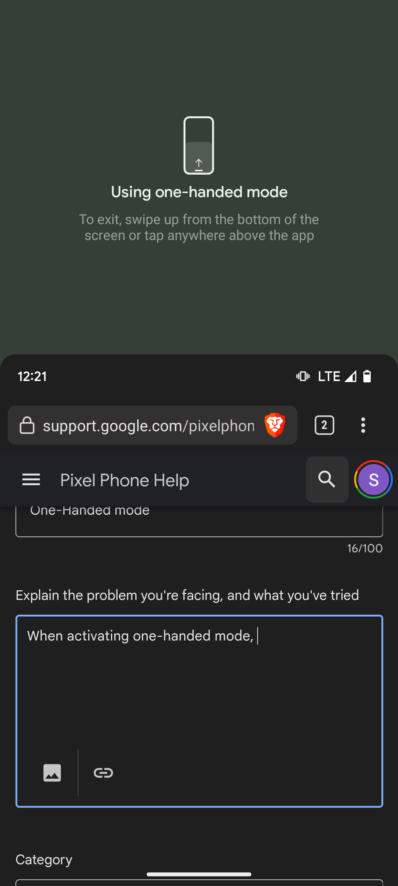
<!--  -->

### 1. Google's official solution baked straight into Android (aka solution stolen from Apple)
Pretty much the only thing worse than this is having no one handed mode at all. This does not resize the image on screen at all, only pulls it down. Not only do you have to constantly enable and disable it to use it properly, but you also lose access to the bottom of the screen completely while this mode is enabled.

And also the cherry on top: some manufacturers (notably, Sony with their Xperia lineup) are ditching their own, significantly better implementation of one handed mode in favor of Google's solution. I'm guessing because they think it's somehow better (it's not) since it's an official Google's solution.

<!-- 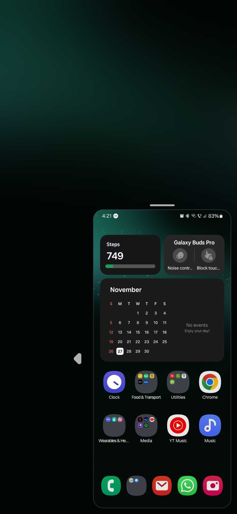 -->


### 2. Third party solutions (Samsung's One UI, Huawei's EMUI, some LineageOS versions, [Sony's Xperia phones prior to Android 12](https://www.reddit.com/r/SonyXperia/comments/tbsl0l/onehandedmode_changed_with_android_12_but_the/))
Only available on some manufacturers' custom Android skins and very few LineageOS versions, like LOS 14.1. Instead of just pulling your screen down, makes it smaller so that it's easier to reach with one hand. Unlike Google's solution, does not require constant enabling and disabling, and can be kept enabled pretty much all the time if so desired. I personally don't really like it that much, since there is absolutely no problem with phones' width when it comes to one hand reachability, only with height, so ideally the screen should only become lower, but not narrower. ***Still significanly better and more usable solution.***

### 3. My proposed solution
First: design **ALL** apps with one hand reachability in mind to begin with. Like what Samsung does with their One UI apps. Really, why is that still not a standard? Phones have been ***huge*** (over 6 inches) for ages now. Notice how scroll lists begin at the middle of the screen rather than the top for easy reachability. Also the buttons (back, search, three dots) which would normally be at the very top right/top left of the display are now much closer to the center as well. Samsung really did a great job with designing these. Too bad none of the other apps do.

<p float="left">
  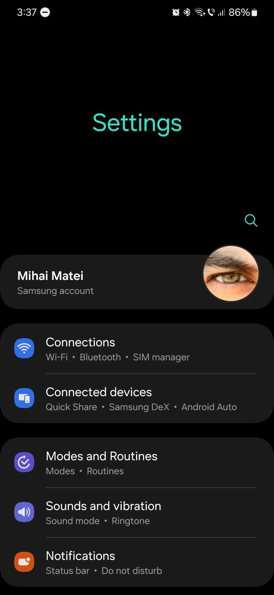
  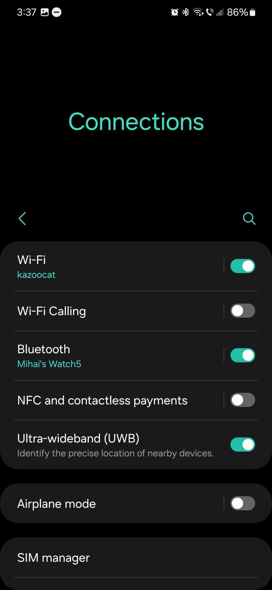 
  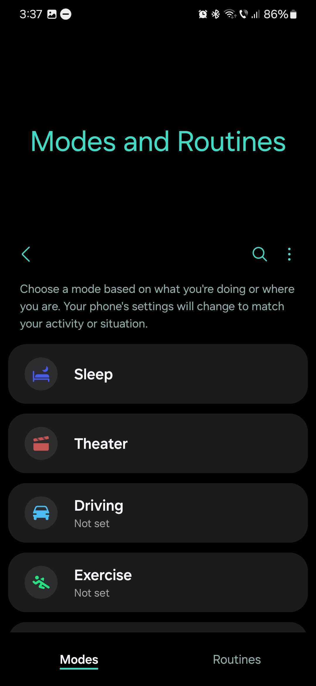
</p>

Second: just change the aspect ratio back to 16:9! Most phones have more than managable width, it's usually the height that's the main problem. If we can't have phones with 16:9 (or at least 18:9 or something) displays again, at least do something with software, god damn it.

That's what I was trying to accomplish with this magisk module.

<p float="left">
  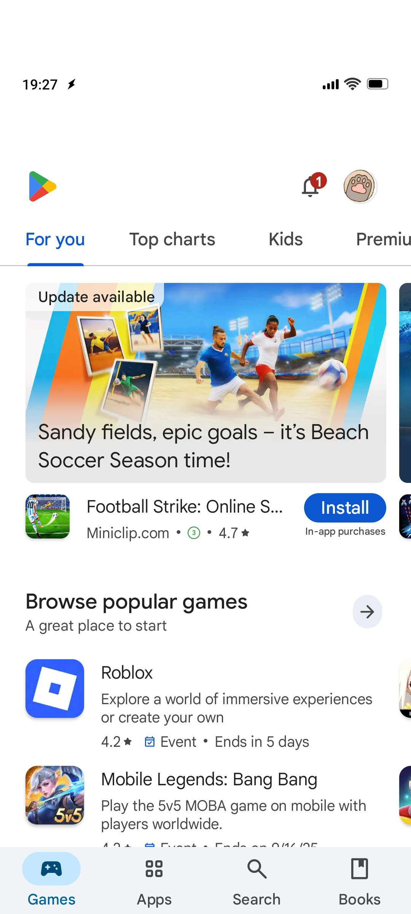
  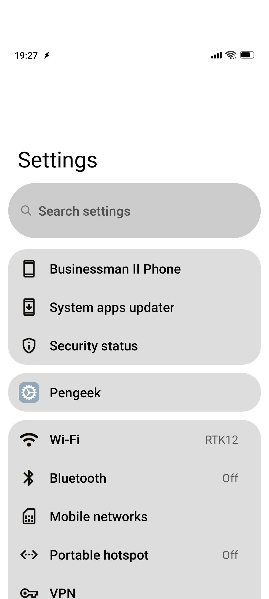 
  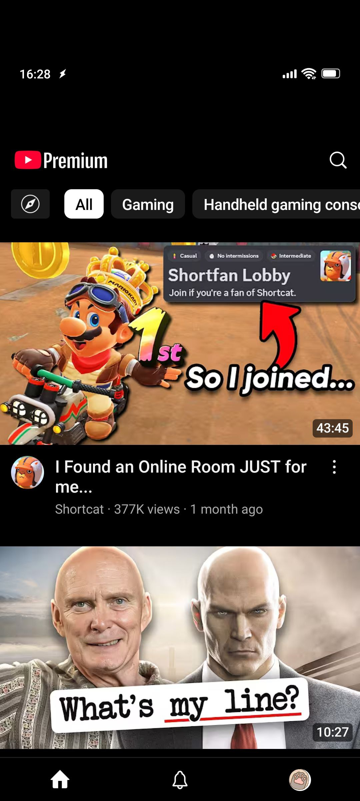
</p>

# Usage

1. Replace every instance of "[dp]" inside of files:

`\DisplayCutoutEmulationNoneOverlay\res\values\strings.xml`

`\noneDisplayCutout\module.prop`

with your desired dp value.

I've used the value of 150 dp on a 1080x2400 6.43" display, which in result gave me a 1080x1987 screen area and 1080x413 notch area.

2. Build using [apktool](https://apktool.org/docs/install/)
```
apktool b DisplayCutoutEmulationNoneOverlay -o cutout.apk
```

3. Sign using [uber apk signer](https://github.com/patrickfav/uber-apk-signer/)
```
java -jar uber-apk-signer.jar --apks cutout.apk
```

4. Move resulting `cutout-aligned-debugSigned.apk` file to `\noneDisplayCutout\system\vendor\overlay\DisplayCutoutEmulationNone\DisplayCutoutEmulationNoneOverlay.apk`

5. Archive the contents of the `noneDisplayCutout` directory to a zip archive.

6. Install resulting zip file using magisk.

7. Go to: Settings -> Developer Options -> "Drawing" section -> Display cutout -> select your dp value

8. Your screen should now be shorter.

# Quirks

In landscape mode your interface is going to look odd (like YouTube) or the app is just straight up not going to use your entire notch area (like Twitch).

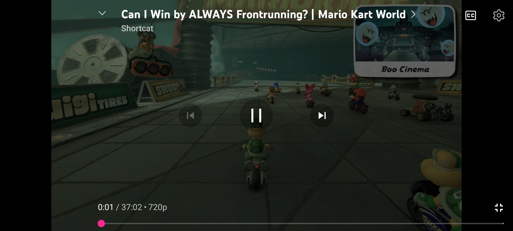
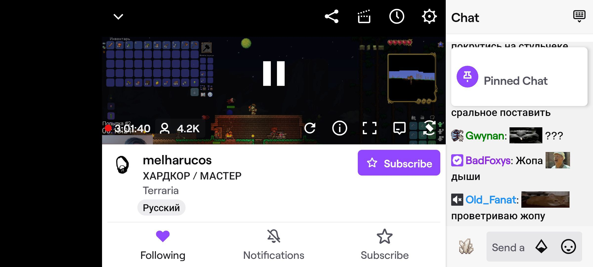

When you pull up your keyboard, the rest of the viewable area is going to be <sup><sub>really small</sup></sub>

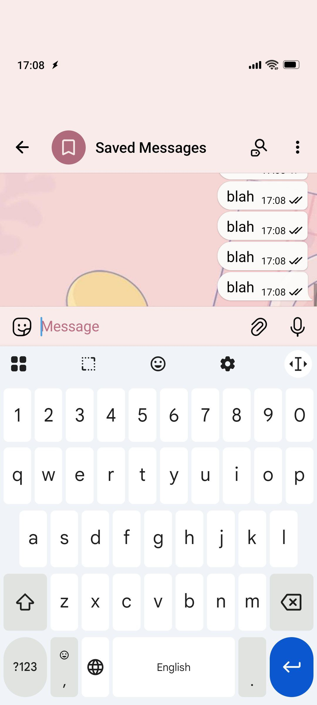

Just general jankiness of this solution. I'm not a developer, I just hacked something together with what I'm able to do. If a real developer wants to implement this properly in some custom ROM, that properly reacts to landscape mode and keyboard, please do, I'm very much looking forward to this being a fully fledged feature.